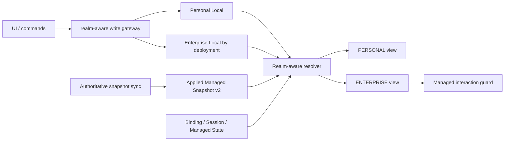

# 可持久化记录与云端同步基线

> 文档状态：2026-08-15 配置治理准备阶段的历史设计基线；已于 2026-08-27 纳入新的 S0.2/S0.3 决议。
> 当前 Android 落盘与 Managed overlay 原型事实以代码及
> [Android 配置架构与企业下发清单](../references/android-configuration-architecture.md) 为准；S0.2 产品、对象和 wire 以
> `measix-architecture` 的 Enterprise Realm & Experience Contract、Control Protocol 和 Portal Product Requirements 为准。
> 本文不能证明企业接入、生产下发、User Sync 或最终数据模型已经实现。

本文是配置治理、可持久化记录与云端同步的设计基线。它以当前代码为事实，回答以下问题：

1. 应用有哪些持久化介质、记录、引用和文件载荷；
2. 当前读写链路的职责、并发、一致性和性能边界；
3. 企业下发、助手市场、MCP 市场应怎样落到这些记录上；
4. 在不改变现有落盘结构的前提下，准备阶段必须先收口哪些架构问题。

当前 Local 落盘模型没有 realm/source 字段或市场导入协议。代码已存在一套签名 Managed overlay、有效读模型和
写锁原型，但没有 Enterprise Binding、ClientRealm、Snapshot v2 ingestion、Managed Memory Seed、Assistant Starter、
Enterprise Update Feed、Portal 或生产同步入口。本文中的目标对象不能表述为当前已实现业务能力。

> 准备阶段约束：不增加或修改 DataStore key、JSON 字段、Room Entity/表/索引/版本、SharedPreferences
> key、文件目录和备份 ZIP entry；不实现企业关联、登录、下发或市场协议。先建立单一写入口、读取物化、
> 写入授权和依赖边界，再进入数据结构迁移阶段。

---

## 0. 2026-08-27 决议增量

S0 内部交付顺序已固定为：

```text
S0.1  Snapshot v1 + A 资源/基础 MCP 服务端基线
  → S0.2 Personal/Enterprise Realm + Snapshot v2 + A/B/C 最小闭环 + Portal MVP
  → S0.3 Android Model/TTS/HTTP-ASR/通用 MCP 全 required runtime integration
```

S0.2 企业交付分类固定为：

```text
A Runtime Resource       Managed Chat Model（v2 继续携带 v1 Model/TTS/ASR）
B Enterprise Capability get_enterprise_updates Managed MCP
C Experience Asset      Managed Assistant + read-only Memory Seed + Assistant Starter
```

以下旧设想被本节覆盖：

- 不再把 `enterprise-overlay` 定义为“按 Android UUID 与 Local 同 ID 合并”的生产协议；平台 `prv_*/mdl_*/mcp_*/asd_*/str_*`
  ID 必须原样保存，不能 hash/strip 成 Local `Uuid`；
- 不再把 Enterprise 内容与 Personal Local 内容合成一个全局 Effective Settings；Effective Configuration 必须按
  `PERSONAL` 或具体 `ENTERPRISE(deploymentId)` 解析；
- Enterprise Realm 的内容策略是 `Managed Only` 或 `Managed + Enterprise Local`。Personal Local 不自动进入 Enterprise Realm，
  应用 Built-in 也不能作为可选 A/B/C 内容绕过 Managed Only；
- Managed Assistant 不是完整 Local `Assistant` JSON；Memory Seed 和 Starter 也不是 `MemoryEntity`/`QuickMessage` 的持久化复用；
- 企业助手产生的 Enterprise Local Memory 将来必须回传进入 User Sync/Experience Contribution 闭环，但不直接改写已发布 seed。

当前 `ManagedConfigurationEnvelope(schemaVersion=1)` 仍是代码事实和可复用实现经验，但与 S0.2 Snapshot v2 不兼容；实施时必须
收敛为唯一生产 ingestion/owner，不能保留双协议或兼容旁路。

---

## 1. 产品需求与抽象

未来要支持以下能力：

1. **企业下发**：按 A/B/C Definition 与 Managed Release 下发；Managed 内容在 App 内只读。
2. **助手市场**：下载助手定义。同 ID 覆盖，或生成新 ID（重命名/复制）。
3. **MCP 市场**：下载用户可编辑的 MCP 连接。企业 MCP 与用户 MCP 共存。
4. **企业经验回流**：企业助手产生的本地记忆和后续场景结果进入独立 User Sync/Contribution 流程。

这些能力不能用一个 `Settings JSON`、一张来源表或一套同步协议表达。Local/Managed、Personal/Enterprise、Definition/User Data
是三个正交维度，必须分别建模。

| 概念 | 含义 |
|------|------|
| **记录** | 有稳定身份、可单独增删改的一条配置或数据 |
| **身份** | Local 多数是 `Uuid`；Managed 使用平台 typed ID；两者不能互相转换冒充 |
| **载荷** | 身份之外的可序列化内容 |
| **机密** | 载荷里的密钥、令牌、密码。与公开定义分开传输和权限 |
| **引用** | 指向另一条记录身份的字段。导入必须重映射或校验 |
| **来源** | `BUILT_IN` / `LOCAL` / `MANAGED`；当前代码已有读模型来源，Local 持久记录仍无 source 字段 |
| **Realm** | `PERSONAL` 或 `ENTERPRISE(deploymentId)`；当前代码尚未实现 |
| **可变性** | Managed Definition/Seed/Starter 只读；Personal/Enterprise Local 由对应 owner 修改 |
| **通道** | `managed-delivery` / `marketplace-package` / `user-sync` / `preference-sync` / `backup`，版本与冲突模型互不复用 |

细化后的产品规则：

- 企业下发进入独立 Managed Store/Projection，不写入 Personal `Settings` 或 Local credential。Enterprise Realm 是否允许同类
  Enterprise Local 由 Managed Policy 决定。
- 市场包是**引用图**，不是单条 `Assistant` JSON。助手会引用 MCP、注入、快捷消息、标签、Skill、工作区。
- 覆盖 = 同身份替换公开载荷；复制 = 新身份 + 重写包内引用。
- 记忆默认**不进**助手市场包。Managed Memory Seed 随 Release 下发且只读；运行产生的 Enterprise Local Memory 是 User Data。
- 机密不进市场包。企业机密只走企业通道，客户端不可编辑。
- 当前 `selectedSearchServiceId` 已使用 `SearchServiceOptions.id: Uuid`；后续偏好同步必须继续传稳定 id，
  并在目标记录缺失时执行显式回退，不能重新引入列表下标。
- Child Conversation（`parentConversationId != null`）不是用户配置，不进市场，也不进企业下发。

---

## 2. 存储拓扑

| 存储 | 入口 | 持久化内容 | 同步定位 |
|------|------|------------|----------|
| DataStore Preferences `"settings"` | `SettingsStore` / `Settings` | 当前无 Realm 的 Local 全局配置；每个逻辑字段一个 key，复杂对象为独立 JSON 字符串 | S0.2 迁移后的 Personal Local/市场/偏好底座；Managed Delivery 不得写入 |
| SharedPreferences `"MeasixPilot.preferences"` | `ui/hooks/SharedPreferences.kt` | 颜色模式、AMOLED、宽屏侧栏、启动时新建会话、最近会话、搜索排序等设备 UI/导航状态 | 默认不上云；不能混入企业配置 |
| SharedPreferences `"crash_handler"` | `CrashHandler` | 崩溃标记与截断堆栈 | 仅设备诊断，不备份、不同步 |
| Room `AppDatabase` | DAO / Repository | 会话、消息节点、记忆、工作区、文件元数据、生成媒体、收藏、文件夹 | 运行数据与备份；不是企业配置表 |
| 应用 `filesDir` | `FileFolders`、`SkillManager`、`WorkspaceManager`、`FilesManager`、`GeneratedMediaStore` | Skill、上传、字体、工具输出、生成媒体、Workspace Rootfs、FTS 词典 | 按目录分别进入市场、备份或不上传 |
| 应用 `cacheDir` | 备份、OCR、导出、相机等入口 | 可重建的下载包、OCR cache、导出和拍摄临时文件 | 不同步，不得作为持久化真源 |
| 备份 ZIP | `WebDavSync` / `S3Sync` | `settings.json`、数据库/WAL/SHM、部分 `filesDir` 目录 | 灾备格式；与记录级配置同步严格分离 |

生产数据库名是 `measix_pilot`，Room 当前使用 WAL 与显式历史迁移链。`message_fts` 是在数据库
打开回调里建立的运行时 FTS5 虚表，不属于 Room schema JSON；数据库备份和恢复仍必须考虑它与
Jieba 扩展的重建行为。

写入规则（当前实现）：

- `SettingsStore.updateLocal()`：互斥读取最新非 dummy Local shadow → `materializeForRead` → transform →
  `requireLocalSettingsWriteAllowed`（基于最新 effective access index 复验）→ `updateInternal`。
- `commitSettings()` 统一执行 `normalizeForPersistence` → `canonicalizeForDataStore` → DataStore 写入成功 →
  发布 Local shadow；DataStore 回读和 effective projection 再使用 `materializeForRead`。
- `normalizeForPersistence` **只**规范化 `Assistant.description`、关闭类别时清掉 `isSubAssistantGloballyVisible`、按 `assistantId` 去重 tombstone。它**不**清理失效引用。
- DataStore 标量规范化只复用原有落盘约束：空搜索服务列表补默认项、`selectedSearchServiceId`
  限制为现存记录 id（否则回退首项）、TTS 默认速度限制在有效范围。约束在提交阶段完成，避免磁盘值与提交返回值不一致。
- 失效引用、重复 id、内置 Provider/助手/TTS 补齐由纯 `materializeForRead` 负责；DataStore 回读与
  提交后发布共用它。导入/同步如果只调用 `normalizeForPersistence`，仍不会得到读取物化那套清理。
- `SearchServiceOptions`、`TTSProviderSetting`、`ASRProviderSetting` 用 `decodeListLenient`：未知密封子类会被跳过。
- `ProviderSetting.builtIn` 与描述 lambda 是 `@Transient`。磁盘上没有 `builtIn`；加载时若 id 落在 `DEFAULT_PROVIDERS` 里，再把内置标记和描述补回去。
- `Settings.pendingAssistantDeletions` 在数据类上是 `@Transient`，因此不会进整份 Settings JSON / 备份快照；它另有 DataStore key，供跨进程删除恢复。

### 2.1 当前 Settings 读取链路

```text
DataStore Preferences
  -> 逐 key 解码为持久化 Settings 快照
  -> LocalSettingsSnapshot（含 explicitDefaultPaths）
  -> materializeForRead：补齐内置项、恢复运行时属性、按 id 去重并清理部分失效引用
  -> EffectiveSettingsResolver 与 verified managed prototype snapshot 合并
  -> effectiveSettings（当前应用消费的全局有效快照）
```

“持久化快照”和“应用有效快照”不是同一个概念。补齐内置项与清理引用只用于读取，不应无提示地
反写 DataStore。写成功后的主动内存发布必须复用同一读取物化函数，否则可能先发布含重复项或失效
引用的值，再被 DataStore 回读改成另一份值。

### 2.2 当前 Settings 写入链路

```text
调用方 transform
  -> SettingsStore.updateLocal Mutex 内读取最新非 dummy Local shadow 与 effective snapshot
  -> 在 materialized Local 上执行 transform
  -> requireLocalSettingsWriteAllowed 对最新 access index 复验变化路径
  -> normalizeForPersistence
  -> canonicalizeForDataStore
  -> 单次 DataStore edit 写完全部 key
  -> edit 成功
  -> 发布 LocalSettingsSnapshot
  -> EffectiveSettingsResolver 重新发布 effectiveSettings
```

写失败时不得发布内存值。`pendingAssistantDeletions` 只有明确的删除恢复流程可以增删；备份 JSON、
UI 快照和市场包都不能因 `@Transient` 默认值而清空它。

### 2.3 Room 与文件双写

Room 事务只能保证数据库内部一致性，不能覆盖 `filesDir`。当前项目按不同业务采用补偿式协议：

- `FilesManager` 以 Mutex 串行文件/`artifact` 变更，写 DB 失败时删除已创建文件（`registerTrackedFile`
  同步登记失败回滚，"文件 + 记录"要么都在要么都不在）；启动 `ArtifactStore.reconcileStartup()`
  单向收敛磁盘侧外部不一致（缺失行清理、untracked 仅日志，无补录）；
- `GeneratedMediaStore` 使用 pending 文件、rename、Room 元数据与 `reconcile`；
- `SkillManager` 用 staging/backup 目录原子替换 Skill，但删除 Skill 后再清理 Assistant 引用，
  失败时需要后续 orphan prune；
- Assistant 删除先持久化 tombstone，再停止运行、清理 Room/文件，最后移除 tombstone。

未来同步不能假设“一个 Room transaction 可以同时提交文件”。每个跨介质操作都必须明确提交顺序、
幂等键、补偿动作和启动恢复入口。

### 2.4 持久化与同步依赖边界

| 依赖/机制 | 当前用途 | 不能承担的职责 |
|-----------|----------|----------------|
| AndroidX DataStore Preferences | `settings` 的原子 `edit`、Flow 回读与 I/O 错误传播 | 不是记录级数据库；标准 `preferencesDataStore` 委托也不是未来多进程企业同步协议 |
| kotlinx.serialization | `Settings` 各复杂 key、Room TypeConverter、备份 JSON；`JsonInstant` 忽略未知字段并编码默认值 | 不能验证来源、签名、引用完整性或机密权限；宽松解码不能等同导入成功 |
| Kotlin Coroutines / Flow / Mutex | 串行 Settings transform、发布有效快照、观察缓存依赖 | 进程内 Mutex 不能替代跨进程锁、远端 generation 或跨介质事务 |
| Room + KSP | 结构化运行数据、DAO/Repository、migration 与 schema 导出 | Room transaction 不能覆盖 `filesDir`，也不能让打开中的数据库文件恢复天然安全 |
| requery SQLite + simple/Jieba 扩展 | 实际 SQLite 驱动、运行时 FTS5 与分词能力 | 运行时创建的 FTS 对象不由 Room schema JSON 完整描述，备份恢复必须另行验证重建 |
| `java.util.zip` | 当前 WebDAV/S3 备份 archive | 只提供流式压缩/解压；不提供 manifest、签名、路径授权、原子恢复或回滚 |
| Ktor `HttpClient` | 自研 WebDAV client、S3 client 与 SigV4 传输 | transport 成功不代表包可信、完整或可提交；企业验签必须位于独立通道 |
| Koin | 组装 Store、Repository、Manager、缓存观察者 | 业务对象不应通过 `KoinComponent` 反向查找上层依赖或隐藏写副作用 |
| Pebble | Assistant message template 编译缓存 | 缓存失效不是持久化职责，缓存键本身必须包含决定编译结果的模板内容 |

依赖方向固定为：UI → ViewModel/记录命令 → Store/Repository/领域 Manager → DataStore、Room 或文件；
同步入口只能调用记录命令与领域 Manager，不能直接从 UI 写 Store，也不能绕过补偿协议直写 DAO + File。
当前 `EffectiveSettingsResolver` 与 lock/access index 位于消费模型和写策略层，没有反向塞进 DataStore 序列化模型；
S0.2 实施必须把该原则扩展为 realm-aware owner，而不是继续扩大现有全局 overlay。

---

## 3. 记录目录

只列**同步时要当一条记录对待**的东西。内嵌值对象（`AssistantRegex`、`CustomHeader`、`McpTool`、`BalanceOption`）随父记录走，不单独建通道。

### 3.1 DataStore 记录

| 记录 | 身份 | 机密 | 主要引用 | 建议通道 | 说明 |
|------|------|------|----------|----------|------|
| `ProviderSetting` | `id` | `apiKey`、Google `privateKey` 等 | 内嵌 `Model.id` | Personal/Enterprise Local 或市场；不是 Managed wire | `OpenAI` / `Google` / `Claude`。内置预设靠固定 id 在加载时补齐 |
| `Model` | `id`（不是 `modelId`） | 可经 `providerOverwrite` 再带一份密钥 | 可嵌套另一份 `ProviderSetting` | 随所属 Provider | `modelId` 是线协议名；同步身份必须用内部 `id` |
| 全局模型选择 | 各 `Settings.*ModelId` | 无 | → Local `Model.id` | Local 偏好；Managed default 属于 Snapshot Policy | 未写入时聊天/快速/压缩回退 `DEFAULT_AUTO_MODEL_ID` |
| `Settings.assistantId` | 无（单值） | 无 | → `Assistant.id` | 偏好或不上云 | 只表示新建会话等入口的当前助手，不是已有会话归属 |
| `McpServerConfig` | `id` | `headers`、OAuth 令牌 | 无出站引用 | Personal/Enterprise Local 或 MCP 市场 | Managed MCP 使用独立平台 ID/runtime auth；`tools` 是 Local 连接缓存 |
| `TTSProviderSetting` | `id` | 云端 TTS 的 `apiKey` | 无 | Local | Managed TTS 是独立 Definition；`SystemTTS` 无密钥 |
| `ASRProviderSetting` | `id` | `apiKey` | 无 | Local | Managed HTTP ASR 是独立 Definition，不复用当前 realtime 对象 |
| `SearchServiceOptions` | `id` | Tavily `apiKey`、SearXNG 密码 | 无 | Local | S0.2 不下发 Search；当前通过 `selectedSearchServiceId` 选择 |
| `Assistant` | `id` | 无直接密钥 | 见 §4 | 助手市场 | 定义见 `Assistant.kt` |
| `PromptInjection.ModeInjection` | `id` | 无 | 被助手/会话引用 | 可随助手打包 | |
| `QuickMessage` | `id` | 无 | 被助手引用 | 可随助手打包 | |
| `Tag` | `id` | 无 | 被 `Assistant.tags` 引用 | 可随助手打包 | |
| 模型级 Prompt 字符串 | 无（单值） | 无 | 无 | Local | S0.2 不下发这些全局任务 Prompt |
| `DisplaySetting` 与主题 | 无或 `CustomTheme.id` | 自定义字体是本地路径 | `chatCustomFontPath` → `filesDir/fonts` | 偏好同步 | 不要逐字段同步；整包或白名单 |
| 备份端点 | 无 | WebDAV/S3 密码与密钥 | 无 | 默认不同步到企业/市场 | 这是备份通道自己的凭据 |
| `developerMode` / `launchCount` / `ignoredUpdateVersion` | 无 | 无 | 无 | 不同步 | 设备或进程本地 |

`Settings` 不是天然的一条同步记录；它只是当前 Local DataStore 的内存聚合。市场/偏好/User Sync 必须按记录边界
产生操作；Managed Delivery 则完全走 Snapshot owner，不能把远端整份 `Settings` 覆盖到任何 Local store。备份恢复可以
替换其所属 Local 快照，但仍要经过 realm、来源和内部状态保护。

`Assistant` 上同步真正危险的是引用，不是把整份数据类再抄一遍：

| 引用字段 | 指向 |
|----------|------|
| `chatModelId` | `Model.id` |
| `tags` | `Tag.id` |
| `modeInjectionIds` | `ModeInjection.id` |
| `quickMessageIds` | `QuickMessage.id` |
| `mcpServers` | `McpServerConfig.id` |
| `workspaceId` | `WorkspaceEntity.id` |
| `enabledSkills` | Skill 目录名 |
| `allowedSubAssistantIds` | 其他 `Assistant.id` |

`localTools`、`regexes`、`presetMessages`、`customHeaders`/`customBodies` 是内嵌值，随助手复制。`LocalToolOption` 的序列化名是 `javascript_engine`、`assistant_delegation` 等，以代码为准。

### 3.2 Room 记录

| 记录 | 身份 | 引用 | 建议通道 | 说明 |
|------|------|------|----------|------|
| `ConversationEntity` | `id` | `assistantId`、`folderId`、`parentConversationId`、`modeInjectionIds` | 仅备份 | `nodes` 列已空置；消息在 `MessageNodeEntity`。`tags` 仍在会话行上 |
| `MessageNodeEntity` | `id` | `conversation_id` | 随会话备份 | `messages` 为 `List<UIMessage>` JSON |
| `MemoryEntity` | 自增 `id` | `assistantId`（或 `GLOBAL_MEMORY_ID`） | 默认不上市场；Personal 可备份，Enterprise Local 未来进入 User Sync | 当前没有 realm/provenance；不得承载 Managed Memory Seed |
| `WorkspaceEntity` | `id` | 被 `Assistant.workspaceId` 引用 | 定义可打包；Rootfs 走文件/备份 | `root` 唯一。`toolApprovals` 是用户覆盖 |
| `FolderEntity` | `id` | `assistantId` | 备份 | 助手内分组 |
| `FavoriteEntity` | 自有主键 | 指向消息/会话 | 备份 | |
| `GenMediaEntity` / `ArtifactEntity` | 自有主键 | 文件路径 | 备份 | 元数据；字节在 `filesDir` |

普通用户列表、搜索、最近对话工具只看 `parent_conversation_id IS NULL` 的会话。Child 行是子助手内部工作区。

### 3.3 文件系统

| 路径 | 内容 | 建议通道 |
|------|------|----------|
| `filesDir/skills/<name>/` | `SKILL.md` 与附属文件 | 市场可按名覆盖或改名；助手只引用名字 |
| `filesDir/upload/` | 用户上传与聊天附件 | 备份 |
| `filesDir/fonts/` | 自定义聊天字体 | 偏好同步需带文件，或只同步主题、不带路径 |
| `filesDir/tool_outputs/` | `ArtifactStore` 管理的归档 Tool Result payload | 随数据库与 durable files 一起备份；不进配置下发 |
| `filesDir/workspaces/<root>/` | Workspace Rootfs 与用户文件 | 备份或企业镜像；体积大 |
| `filesDir/images/` | 文生图/编辑图的规范产物；元数据在 `GenMediaEntity` | 用户备份；不进配置下发或市场 |
| `filesDir/jieba/` | FTS simple tokenizer 运行词典 | 可由应用资源重建，不同步 |
| 助手 `avatar` / `background` 的本地 URI | 图片文件 | 市场包要内嵌或改成远端 URL |

---

## 4. 引用图

```text
Settings
├─ providers[]
│  └─ models[]
│     └─ providerOverwrite?          → 另一份 Provider 载荷
├─ *ModelId / favoriteModels         → Model.id
├─ assistantId                       → Assistant.id
├─ assistants[]
│  ├─ chatModelId                    → Model.id
│  ├─ tags                           → Tag.id
│  ├─ modeInjectionIds               → ModeInjection.id
│  ├─ quickMessageIds                → QuickMessage.id
│  ├─ mcpServers                     → McpServerConfig.id
│  ├─ workspaceId                    → WorkspaceEntity.id
│  ├─ enabledSkills                  → skills/<name>
│  └─ allowedSubAssistantIds         → Assistant.id
├─ mcpServers[] / ttsProviders[] / asrProviders[] / searchServices[]
├─ modeInjections[] / quickMessages[] / assistantTags[]
└─ displaySetting.chatCustomFontPath → filesDir/fonts

Room
├─ Conversation.assistantId          → Assistant.id
├─ Conversation.modeInjectionIds     → ModeInjection.id
├─ Conversation.folderId             → Folder.id
├─ Conversation.parentConversationId → Conversation.id
├─ Memory.assistantId                → Assistant.id 或 GLOBAL_MEMORY_ID
└─ Folder.assistantId                → Assistant.id
```

导入助手包时，至少处理上表所有从 `Assistant` 出发的边。现有加载期清理会丢掉指向不存在 MCP/注入/快捷消息的 id；**不会**自动下载缺失依赖。

---

## 5. 企业配置与同步目标架构

企业“只读”不能等价于把编辑控件设为 disabled。Compose、ViewModel、备份恢复、市场导入、工具调用
和将来的后台同步都可能写配置；真正的强制边界必须位于持久化提交前。

### 5.1 五类 owner 分离

企业数据不直接混写进现有 `Settings` JSON。目标架构至少分离：

1. Personal Local Configuration；
2. deployment-scoped Enterprise Local Configuration；
3. Applied Managed Snapshot v2 与 generation-bound projection；
4. Enterprise Binding/Refresh Credential/Session/Managed State；
5. Enterprise Update Feed cache 与未来 User Sync outbox/inbox。

具体 class/file/schema 由实施阶段决定，但 owner 与备份边界不能合并。概念链路为：



### 5.2 Realm 解析与冲突规则

```text
PERSONAL
  = Built-in + Personal Local

ENTERPRISE(deploymentId)
  = Managed + policy-allowed Enterprise Local(deploymentId)
```

- Personal Realm 不展示、注册、解析或执行任何 Managed/Enterprise Local 内容；
- Personal Local 不自动进入 Enterprise Realm；Enterprise Local 不能复用 Personal Secret/Memory；
- Managed 平台 ID 与 Local UUID 不存在同 ID shadow/覆盖关系；冲突按 origin-aware key 处理；
- Snapshot 内引用只能指向同 generation 的 Managed Definition；不能落到本机碰巧相似的 Local record；
- Realm switch 不改变已有 Conversation/Assistant/Memory/Attachment/Workspace ownership，也不改变正在执行 interaction 的 captured context。

Snapshot 应用是 generation 单调的 whole-state commit。下载、TLS/schema/reference/hash/deployment 校验失败时保留 LKG，但不能
用 LKG 绕过 authoritative state/generation barrier 开始新的 Managed interaction。

### 5.3 写入来源与授权

所有 Local 配置变更必须携带 realm/source command context；Managed Definition 只能由 Snapshot ingestion owner 原子替换，不能
通过通用 Settings mutation gateway 写入。

- Personal Local、Enterprise Local、备份和市场命令只能写各自 owner，不得修改 Managed Store；
- Snapshot ingestion 不能暴露给 UI、工具或通用 JSON 导入；
- 策略在提交边界对当前 realm/deployment/generation 重验，不能只在页面打开时检查；
- UI 使用锁索引展示原因、来源和禁用状态，但 UI 判断不是授权依据；
- 运行时始终消费有效读模型，避免用户通过旧会话或后台任务继续使用已撤回企业密钥。

当前 `updateLocal()`、`ManagedConfigurationStorage`、`EffectiveSettingsResolver` 和 lock UI 只提供实现经验；它们仍是全局
Local + overlay 原型，没有 ClientRealm 和平台 typed ID，不能直接命名为 S0.2 owner。

### 5.4 机密边界

企业 Upstream/Provider/TTS/ASR/MCP Secret 保留在服务端；Android 只持有受保护的 Enterprise Session credential 和
client-safe Definition。Refresh Credential 不进入 Settings、Managed Snapshot、普通备份、日志或 WebView；Access Token 只在
受控内存生命周期使用。

---

## 6. 各类需求怎样落到记录上

### 6.1 S0.2 Managed Delivery

Snapshot v2 保留 v1 A/B/Policy，并增加 C 类：

```text
A  Managed Chat Model（TTS/ASR 完整 Android execution 属于 S0.3）
B  get_enterprise_updates Managed MCP
C  ManagedAssistantDefinition + Memory Seed + AssistantStarterDefinition
```

Android 复用现有 Chat、MCP tool loop、Assistant UI、memory prompt injection 和 Quick Message 交互边界，但不能复用其 Local
持久化身份/聚合：

- Managed Assistant 是独立只读 projection，不写 `Settings.assistants`；
- Memory Seed 随 generation 原子切换，不写 `MemoryEntity`，`memory_tool` 不能增删改 seed；
- Assistant Starter 使用现有“点击后向输入草稿追加文本”的交互，但保持 `str_*` 身份，不写 `QuickMessage.id: Uuid`，不 auto-send；
- Managed MCP 使用平台 runtime URL/auth，不能写 Local URL/header/OAuth；
- Enterprise Update 使用独立 Feed cache/revision，不进入 Snapshot/Settings，也不改变 `managedGeneration`。

### 6.2 助手市场（`marketplace-package`）

包内应是图，而不是裸 `Assistant`：

- 必选：`Assistant` 公开载荷（提示、参数、工具开关、正则、预置消息等）
- 按引用带上：`ModeInjection`、`QuickMessage`、`Tag`、Skill 目录
- 可选：用户 MCP 的**非机密**连接描述（url、name）；密钥让用户填
- 默认不带：Memory、Conversation、Workspace Rootfs、OAuth、企业 Provider

覆盖：目标已有同 `Assistant.id` 则替换定义，引用仍指向用户环境里已有的 MCP/工作区。  
复制：新 `Assistant.id`，包内注入/快捷消息/标签生成新 id，并改写助手上的引用。Skill 按名合并，重名则覆盖或改名后改 `enabledSkills`。

`allowedSubAssistantIds` 指向包外助手时，导入后应视为未解析，不能静默指向用户机器上碰巧同 id 的助手。

### 6.3 MCP 市场

市场 MCP 导入后属于 Personal Local 或用户明确创建的 Enterprise Local；它不与 Managed MCP 共用持久记录/credential owner。
`McpCommonOptions.tools` 以连上服务器后的 `mergeTools` 为准，不要把缓存 schema 当市场真源。Local OAuth 令牌留在设备，
Managed MCP 不复用这套 OAuth 写协议。

### 6.4 企业助手记忆与经验回流

S0.2 只交付只读 Memory Seed 和可变 Enterprise Local Assistant Memory 的分离，不实现上传。后续必须实现：

```text
Enterprise Local Memory durable commit
→ User Sync change capture/outbox
→ server acceptance/dedup/order
→ Experience Contribution review/evaluation
→ new Managed Assistant/Seed/Starter Release
```

回流记录至少保留 deployment/user/assistantDefinition、source conversation/message/tool/run、产生时 managedGeneration、
本地稳定身份/revision 和敏感/共享范围。同步失败不回滚已成功的本地记忆；未审核 Contribution 不能直接成为下发经验。

---

## 7. 当前架构审查与准备阶段决策

| 现状/风险 | 影响 | 准备阶段决策 |
|-----------|------|----------------|
| `SettingsStore` 同时负责 key、解码、默认补齐、引用清理、写入、内存发布和 Pebble 缓存副作用 | 难测试；持久化层通过 Koin 反向查找模板引擎，依赖方向隐式成环 | 把读取物化、写策略和模板缓存观察者拆开；Store 只编排 DataStore 与发布 |
| 写成功后手工发布值与 DataStore 回读还会经过不同清理步骤 | 同一次提交可能短暂或最终暴露不同有效状态 | 读回与提交后发布共用纯 `materializeForRead` |
| 多个页面/VM 把采集到的整份旧 `Settings` 复制后回写 | 与工具、后台恢复、其他页面并发时可覆盖无关新值；企业锁无法稳定重验 | 本地编辑统一改为 Mutex 内基于最新值的 transform/记录命令；整份替换仅保留给显式备份恢复 |
| Composable/通用 UI 组件直接注入 `SettingsStore` 并写收藏等配置 | UI 与持久化实现耦合，锁定策略容易漏入口 | 读写接口分离；写操作经 VM/command gateway，组件只接收状态与 callback |
| 外层使用最新 `Settings`，但内层 WebDAV/S3/提醒/注入列表仍由旧页面快照整对象替换 | 快速输入或后台写入时仍会丢掉同记录的并发字段 | 内层编辑也改成对 Mutex 内最新记录执行字段 transform 或稳定 id 命令 |
| MCP 工具同步先在 Mutex 外复制完整连接记录 | OAuth/连接参数并发刷新时可能被旧记录覆盖 | 只把服务器工具列表带入 transform，在最新 MCP 记录上合并 `tools` |
| 用户头像在 Settings 写入前删除旧文件 | DataStore 写失败会留下仍指向已删除文件的旧配置 | 提交接口返回策略处理后的实际值；只依据已提交值执行旧头像/背景清理，写失败或策略拒绝不触碰旧文件 |
| DataStore 每次变更都编码并设置完整 Settings key 集 | 大列表与 JSON 在高频输入时产生额外 CPU/分配；DataStore 最终仍是整文件提交 | 本轮优先消除无意义/陈旧快照写与无关缓存失效；字段 diff 编码需单独兼容测试后再做 |
| Pebble 缓存在任意 Settings 变化时全量失效 | 主题、计数、备份配置变化也触发无关缓存清理 | 独立观察 Assistant `id + messageTemplate` 指纹后再失效 |
| 历史版本曾用 `searchServiceSelected` 列表下标 | 排序、删除和跨设备偏好同步会选错记录 | 当前已迁移为 `selectedSearchServiceId`；同步协议继续使用稳定 id，并定义缺失引用回退 |
| `WebDavSync` 与 `S3Sync` 重复实现 ZIP 组装/恢复 | 修复容易只落一条通道；当前 transport 与 archive 职责混合 | 后续抽取共同 archive service；传输层只上传/下载。准备阶段先记录格式与恢复风险 |
| 备份直接复制 WAL 数据库文件，并在 Room 仍打开时覆盖 DB/WAL/SHM | 并发写时快照与恢复边界不清，不能作为记录同步实现基础 | 配置同步禁止复用备份实现；数据库灾备另行引入一致快照/受控重启协议和设备测试 |
| ZIP 恢复同时写 Settings、DB 与文件，没有统一 staging/commit | 中途失败可形成跨介质部分恢复 | 后续采用校验清单、staging、数据库版本检查、提交顺序和恢复日志；本轮不改变现有格式 |
| 上传目录 ZIP entry 原先直接拼接目标路径 | 非可信备份可用相对路径逃逸目标目录 | WebDAV/S3 共用规范路径解析并拒绝逃逸；Skill 继续使用 `SkillPaths`，字体继续限定单文件名 |
| SharedPreferences 状态未进入原记录目录 | 容易被误纳入 Settings 同步或在备份语义中遗漏 | 明确归为设备 UI/诊断状态，默认不上云 |
| Room 与文件的业务各自实现补偿 | 新增市场/企业包时容易绕开现有 Manager 直接写磁盘 | 同步层只能调用领域 Store/Manager；禁止直接写 Room DAO + File |
| `StatsVM` 等少数 UI VM 直接依赖 DAO | UI 知道数据库查询细节 | 不影响企业配置，本轮不扩大重构；新代码必须走 Repository/query service |

“不在本轮处理”不代表问题已接受。尤其是数据库备份一致性、稳定搜索服务 id 和企业机密存储，必须
在相应数据迁移/协议阶段作为 release blocker，而不是通过当前架构调整顺带改变落盘格式。

---

## 8. 实现时容易踩的约束

- **身份不是显示名，也不能跨 namespace 转换。** Local 模型用 `Model.id: Uuid`；Managed 模型保留 `mdl_*`；Skill 用目录名；搜索偏好同步前必须使用 `SearchServiceOptions.id`。
- **列表下标不能同步。** 当前 `selectedSearchServiceId` 已消除历史下标问题；任何新同步协议都不得退回列表位置。
- **加载清理 ≠ 写入清理。** 市场导入要显式做引用校验或复用 `materializeForRead` 的过滤规则，不能只信 `normalizeForPersistence`。
- **`@Transient` 不是「不落盘」。** `pendingAssistantDeletions` 有独立 key；`builtIn` 则完全不落盘。
- **会话行上的 `nodes` 不是消息源。** 备份/迁移必须带 `message_node` 表。
- **Workspace 绑定与 Rootfs 分离。** 助手只引用 `workspaceId`；真正的 Linux 树在 `filesDir/workspaces/<root>/`。
- **备份通道 ≠ 配置同步。** `WebDavConfig` / `S3Config` 是备份自己的密钥，不要和企业下发、市场包混在一个 API。
- **有效读模型 ≠ 本地持久化快照。** 当前 prototype overlay 只进入 resolver；S0.2 Managed Snapshot 也只能进入
  realm-aware resolver，普通写入不能把任何 effective projection 整份反写 Local Store。
- **UI 只读 ≠ 数据只读。** 锁定必须由写策略在最新 generation 上重验。
- **来源不能由导入包自报。** `ENTERPRISE_DELIVERY` 只来自验签通道；普通 JSON 带 `enterprise` 字样仍是外部导入。
- **Room 事务 ≠ 跨文件事务。** 市场包和备份恢复必须使用 staging、补偿与恢复日志。
- **SharedPreferences 不是 Settings 扩展区。** 新的重要配置不能为了省事写入 UI hook 的偏好文件。

---

## 9. 准备阶段实施清单

### 9.1 本轮允许的代码调整

- 提取 Settings 读取物化纯函数，供 DataStore 回读和提交后发布复用；
- 建立统一的 Local 写入授权边界；历史草案中的 `SettingsWriteSource` / `SettingsWritePolicy` 名称未保留，
  当前实现收敛为 `updateLocal()` 内调用 `requireLocalSettingsWriteAllowed()`；
- 为备份恢复提供显式入口并保护内部 tombstone；
- 把 Pebble cache invalidation 从持久化层移到独立观察者，只观察模板指纹，并让编译缓存键包含
  助手 id 与模板内容，使正确性不依赖异步失效时序；
- 把本地 UI 的整份 Settings 回写改成最新值上的 transform 或明确的记录级命令；
- 增加读取物化、Local 写入授权、并发 delta、序列化兼容和写失败顺序测试；
- 同步修正引用文档中与真实 `normalizeForPersistence` 职责不一致的描述。

### 9.2 本轮禁止变化的落盘契约

- DataStore 名称和全部 Preferences key 字符串不变；
- `Settings`、Provider、Model、Assistant、MCP、TTS、ASR、Search、主题等序列化字段与 discriminator 不变；
- `pendingAssistantDeletions` 继续只写独立 key，不进入 `Settings` JSON；
- Room 数据库名、版本、Entity、列、索引、外键、migration 和 schema JSON 不变；
- SharedPreferences 文件名/key/默认行为不变；
- `filesDir` 目录、文件命名、URI/相对路径契约不变；
- WebDAV/S3 备份 entry 名称和兼容读取行为不变；
- 不新增 versionCode/versionName，不更新 changelog。

### 9.3 验证门槛

- JVM：Settings 读取物化、Local 写锁、tombstone、Assistant 兼容、相关 UI delta 与现有全量单测；
- Room：确认 schema/migration 文件无 diff；已有迁移链测试保持可运行，本轮无 schema 变更；
- 静态：`git diff --check`、UTF-8 without BOM、文档链接与禁止落盘契约审查；
- 构建：Android Lint 与 Debug APK；
- 最终人工 diff：逐个写入口确认没有旁路策略、没有先发布后写盘、没有把企业能力表述成已实现。

设备级备份恢复、真实企业服务、跨设备同步和数据库一致快照不属于本轮可伪造的验证证据；若未运行，
最终结论必须明确标注。

---

## 10. 代码入口与职责目标

| 代码 | 职责 |
|------|------|
| `SettingsStore` / `Settings` | DataStore 编排、公开有效快照、序列化模型 |
| `SettingsStore.updateLocal` | 在最新 Local/effective 快照上执行 transform 与锁校验，是普通 Local Settings 的唯一写入口 |
| `requireLocalSettingsWriteAllowed` | 比较 Local 变化路径并依据最新 effective access index 拒绝受管锁定字段变更 |
| `commitSettings` | 固化并测试“持久化归一化与 DataStore 规范化 → 落盘 → 发布 Local shadow”的提交顺序；失败不发布 |
| `canonicalizeForDataStore` | 补默认搜索服务、校验 `selectedSearchServiceId`、裁剪 TTS 速度，形成可落盘值 |
| `materializeForRead` | 内置项物化、运行时属性恢复、去重和读取期引用清理 |
| `normalizeForPersistence` | 写入前最小规范化；不得偷偷承担导入图校验 |
| `AssistantTemplateCacheInvalidator` | 观察模板指纹并失效 Pebble cache，不反向污染持久化层 |
| `FavoriteModelService` | 收藏模型的记录级增删/排序命令；通用模型组件不直接写 Store |
| `applySearchMode` / `ProviderSettingsApplicationService.saveConfiguration` / `applyMcpEditorSave` | 聊天搜索、Provider 详情与 MCP 编辑表单在最新记录上合并，避免整份陈旧快照覆盖 |
| `SettingVM` / `ChatVM` / `BackupVM` 等 | 接收字段或记录 transform，不接收整份 UI Settings 快照 |
| `DefaultProviders` | `DEFAULT_PROVIDERS`、`DEFAULT_AUTO_MODEL_ID` |
| `Assistant.kt` | 助手、注入、快捷消息、正则 |
| `ProviderSetting` / `Model` | 提供商与模型 |
| `McpConfig.kt` | MCP 服务器、工具缓存、OAuth |
| `AppDatabase` 与各 Entity | Room 运行数据 |
| `FileFolders` / `SkillManager` / `WorkspaceManager` | 文件与 Skill / Rootfs |
| `FilesManager` / `GeneratedMediaStore` | Room + 文件双写、补偿与对账 |
| `WebDavSync` / `S3Sync` | 当前备份 transport + archive；后续拆出共同 archive service |
| `resolveBackupEntry` / `SkillPaths` | 将恢复目标限制在指定目录内，不允许 ZIP 路径逃逸 |

---

## 11. 准备阶段实施记录

本节只记录已经通过代码与测试验证的结果。设计完成但尚未落地的内容保留在 §9，不提前标记完成。

### 11.1 已完成的架构准备

- `SettingsStore` 不再实现 `KoinComponent` 或反向获取 Pebble 引擎；读取物化、Local 写锁、提交顺序和
  模板缓存观察已拆成独立职责。模板编译缓存键同时包含助手 id 与模板内容，异步观察者只负责回收，
  不再承担避免旧模板命中的正确性职责；
- 普通 Local 写入已收口到 `SettingsStore.updateLocal()`，并在同一互斥区内调用
  `requireLocalSettingsWriteAllowed()`；当前锁来自 verified managed snapshot 的 access index，代码中没有
  `SettingsWriteSource` / `SettingsWritePolicy` 这两个历史草案类型；
- DataStore 写成功后发布的值与 DataStore 回读共用 `materializeForRead`；落盘异常或取消发生在
  `persist` 阶段时不会发布内存快照；搜索服务 id 校验和 TTS 速度等既有落盘裁剪已前移到提交准备阶段，
  提交返回值不再与磁盘值分叉；
- 备份恢复使用显式 `SettingsStore.restoreLocal()` 入口，并合并保留不进入 `settings.json` 的删除 tombstone；
- 设置、备份、聊天、调试、提示词、图片生成等写入口已从整份旧快照改成最新值上的 transform；
  Provider、MCP、TTS、ASR、Search、Theme、Assistant 等列表操作以稳定 id 解析最新记录；
- DisplaySetting 页面使用字段 delta；WebDAV、S3、备份提醒与注入列表直接对最新内层记录执行
  transform，避免“外层原子、内层陈旧”；
- 聊天页切换搜索模式只改最新 Model 的 `tools`，不再用页面快照整份覆盖模型其它字段；
- Provider 详情页配置保存保留最新 `models` 与运行时内置元数据；模型增删改排序在最新
  Provider 上执行。MCP 编辑表单保存保留最新 OAuth 与工具 schema，只覆盖用户改过的
  `enable` / `needsApproval`；
- 模型收藏收口到 `FavoriteModelService`，`ModelList` 不再依赖 `SettingsStore`；`AssistantPicker`
  只回传助手 id；`ImgGenPage` 只调用 ViewModel 命令；
- MCP 工具缓存合并移入最新记录 transform；用户头像和助手背景副作用以策略处理后的实际提交值为准，
  不再以 transform 中的拟议值冒充提交结果；
- WebDAV/S3 恢复共用 `resolveBackupEntry` 拒绝上传目录路径逃逸，未改变 ZIP entry 或目录结构。

### 11.2 落盘兼容性结论

本轮没有修改 DataStore 名称、Preferences key 字符串、`Settings`/Provider/Assistant 等序列化字段、
Room Entity/数据库版本/migration/schema JSON、SharedPreferences、`filesDir` 契约或备份 entry。
新增的锁校验、指纹与协调器全部是运行时结构。`settings.json` 仍不包含
`pendingAssistantDeletions`，恢复后继续保留设备上未完成的内部清理状态。

### 11.3 当前验证记录

定向 JVM 测试已覆盖读取物化、Local 写锁、标量落盘规范化、提交失败不发布、备份恢复保留
tombstone、策略拒绝后的文件补偿、Assistant/tombstone 兼容、DisplaySetting 并发 delta、
聊天搜索模式按最新 Model 改 `tools`、Provider 表单保留最新模型列表、MCP 编辑表单保留
OAuth/新同步工具、收藏模型稳定 id 排序、模板指纹/内容缓存键和备份路径约束，并已通过。
随后已在当前工作树串行完成：

- `gradlew.bat test --no-parallel --max-workers=1`；
- `gradlew.bat lint --no-parallel --max-workers=1`；
- `gradlew.bat assembleDebug --no-parallel --max-workers=1`。

最终审查确认 DataStore Preferences key 集合与基线一致，Room schema/migration、数据库版本、
`app/build.gradle.kts`、SharedPreferences 和序列化模型没有结构 diff；Debug APK 已生成。
本轮未运行设备仪器测试、真实 WebDAV/S3 恢复或企业服务验证，因此这些不属于本轮已证明范围。
